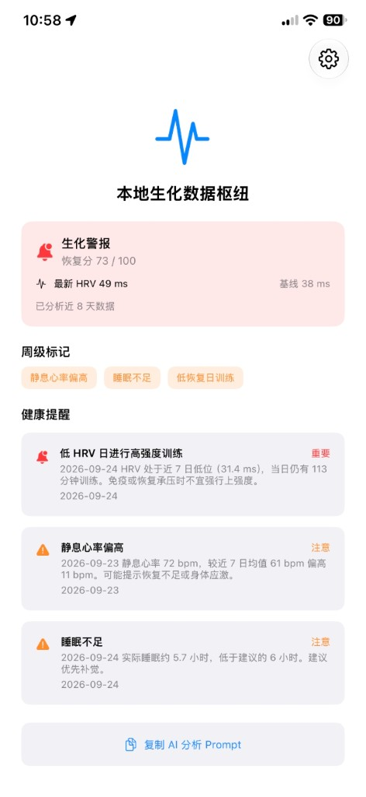
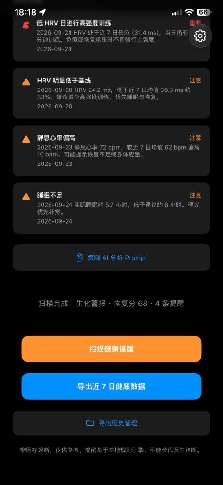
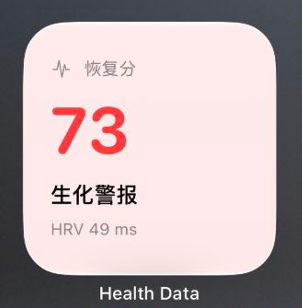
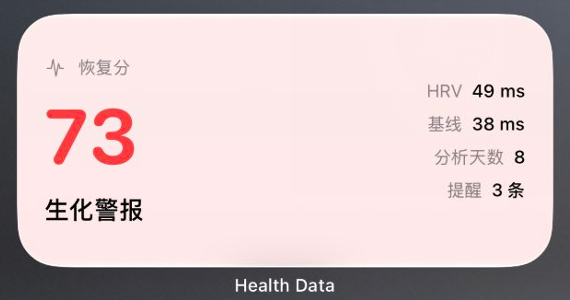

# Health Data

**把 Apple Watch 里的身体数据，变成你能带走、能复盘、能丢给 AI 的本地 JSON。**

如果你有 iPhone 和 Apple Watch，也盯着 HRV、睡眠、静息心率、训练负荷——却发现「健康」App 好看不好带走，商业恢复类 App 好看但不开放——这个项目就是一款**本地生化数据枢纽**：读近 7 日 HealthKit，导出结构化 JSON，用本地规则算出恢复分与健康提醒，一键复制分析 Prompt，交给 ChatGPT / Claude 做量化复盘。

数据**不出手机、不上传云端**。非医疗诊断，仅供个人参考。

[理念](#理念短期点与长期线) · [截图](#截图) · [功能](#功能) · [一起丰富这个场景](#一起丰富这个场景) · [快速开始](#快速开始) · [免责声明](#免责声明)

---

## 理念：短期「点」与长期「线」

健康是一种**生活习惯**。习惯调整靠的是变化趋势，不是单次验血单上的一个数。

| | 短期数据 | 长期数据 | 医院精密检测 |
|--|---------|---------|-------------|
| 回答什么 | 当前恢复 / 应激状态 | 基线漂移、习惯是否奏效 | 「此刻」的高精度结果 |
| 精度要求 | 相对自己够用即可 | 同一尺子、足够密、足够久 | 高，但时间稀疏 |
| 典型窗口 | 天～周（本 App 当前重点） | 月～年（共建方向） | 一年几次 |

手表等可穿戴：**单点精度不如医院，时间密度远超医院。**  
医院：**给你准的点；趋势要靠自己把线画出来。**

本项目的解法不是「取代医院」，而是：

1. **短期**：本地规则 + 恢复分 + 提醒（已实现）——今天练不练、睡够不够  
2. **沉淀**：每次导出的 JSON 可归档（导出历史已具备）——为长期线留原料  
3. **长期趋势 / 习惯对照 / 更丰富的 AI 复盘**——欢迎一起做，见 [一起丰富这个场景](#一起丰富这个场景)

---

## 截图

<p align="center">
  
  &nbsp;
  
</p>

<p align="center">
  
  &nbsp;
  
</p>

| 界面 | 说明 |
|------|------|
| 主页 | 恢复分、相对基线的 HRV、周级标记、本地规则提醒 |
| 导出区 | 扫描提醒、导出近 7 日 JSON、导出历史、复制 AI Prompt |
| Widget | 主屏幕一眼看到恢复分与 HRV（小 / 中尺寸） |

---

## 功能

| | |
|---|---|
| **开放导出** | 23+ 类 HealthKit 指标，按日归并，JSON `schemaVersion: 4` |
| **恢复分 & 提醒** | HRV 断崖 / 偏低、静息心率升高、睡眠不足、低恢复日硬练 |
| **AI 友好** | `suggestedAnalysisPrompt` + 一键复制，JSON 可直接当附件 |
| **隐私优先** | 仅写本机 Documents；无账号、无后端、无强制上云 |
| **主屏幕 Widget** | 恢复分、HRV、提醒数 |
| **后台轻扫** | 系统调度刷新提醒与 Widget（可选本地通知） |
| **导出历史** | 查看、分享、删除已导出文件 |

### 典型用法

1. 授权「健康」→ **扫描健康提醒**，看恢复分与告警  
2. **导出近 7 日健康数据** → `文件 → 我的 iPhone → Health Data`  
3. **复制 AI 分析 Prompt**，把 JSON 交给大模型做周报  
4. 添加 **「恢复分」** 小组件  

---

## 一起丰富这个场景

一个人做不完「习惯 × 长期趋势 × AI 复盘」的全部场景。**欢迎一起把这个开放的本地枢纽做厚。**

尤其欢迎：

- 多周 / 多月归档与**趋势视图**（滚动基线，而不只是近 7 日）  
- 训练 / 作息 / 旅行等**事件标注**，让趋势可解释  
- 更稳健的规则、更少误报、更好的阈值预设  
- 周 / 月 / 年 AI Prompt 与结构化输出  
- 文档、脱敏案例、多语言、Widget / 无障碍体验  

请看 **[CONTRIBUTING.md](./CONTRIBUTING.md)**：开 Issue 讨论想法，或直接提 PR。  
大功能建议先 Issue 对齐方向，再动手——后续较大更新也会持续推到本仓库。

→ [提交 Issue](https://github.com/hequanwei/Health-Data/issues/new) · [看现有讨论](https://github.com/hequanwei/Health-Data/issues)

---

## 导出长什么样

节选指标：心率、静息心率、**HRV (SDNN)**、呼吸率、睡眠、训练、步数、VO2 Max、心率恢复、步行相关、手腕温度、血氧、日光、能量、站立、步长、楼梯速度、环境音量、咖啡因等。

| 字段 | 内容 |
|------|------|
| `dataByDate` | 按日明细 |
| `dailySummaries` | 日级摘要与 flags |
| `weeklyInsight` | 恢复分、周级标记、提醒、AI Prompt |
| `exportSummary` | 样本计数，方便核对权限 |

---

## 技术栈

SwiftUI · HealthKit（async/await + TaskGroup）· WidgetKit · App Groups · BackgroundTasks · UserNotifications  

iOS **18.6+** · `com.personal.Health-Data` · Widget `…widget` · App Group `group.com.personal.Health-Data`

```
Health Data/
├── Health Data/           # 主 App
├── Health Data Widget/    # 小组件
├── docs/screenshots/      # README 截图
└── CONTRIBUTING.md
```

---

## 快速开始

```bash
git clone https://github.com/hequanwei/Health-Data.git
cd Health-Data
open "Health Data.xcodeproj"
```

1. 为 **Health Data** 与 **Health Data WidgetExtension** 选择 Team  
2. 配置 **App Groups**（真机必做）  
3. 真机 Run（⌘R）→ 授权健康 → 扫描 / 导出  

### App Groups

在 [Identifiers](https://developer.apple.com/account/resources/identifiers/list) 为两个 Bundle ID 勾选同一 Group：`group.com.personal.Health-Data`。  
未配置常见报错：*Provisioning profile doesn't include the App Groups capability*。

模拟器可编译，完整能力请以**真机 + Apple Watch** 为准。

### 权限

HealthKit 读取 · 后台 App Refresh · 可选通知 · 文件共享（导出 JSON）

---

## 免责声明

本项目用于个人量化自我与学习交流。输出**不是医疗建议**。身体不适请及时就医。  
请勿在 Issue / PR 中上传含真实可识别健康信息的导出文件。

## License

[MIT](./LICENSE)
